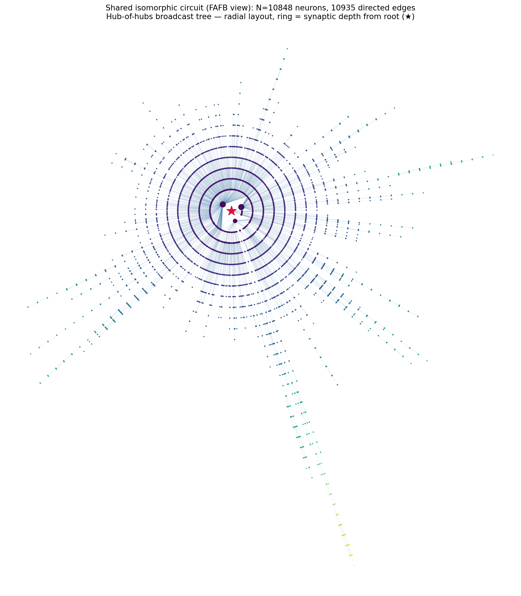
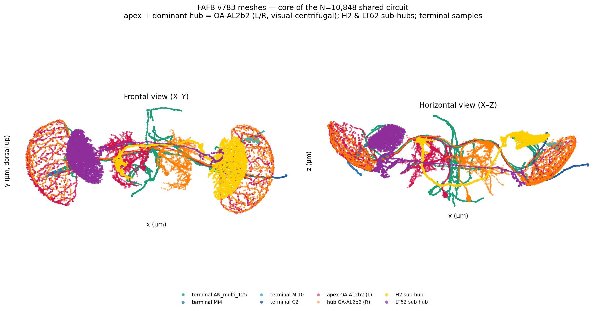

# Divergent centrifugal broadcast onto the medulla — a FAFB interpretation of the shared BANC/MCNS/FAFB directed circuit

**Scientific summary — dataset analysed: FAFB (adult female brain, FlyWire v783).**

A 10,848-neuron set whose induced directed wiring was matched to be identical (graph-isomorphic) across three independent connectomes — BANC, MCNS, FAFB. It is interpreted here in FAFB, where public cell-type metadata exist (Codex / FlyWire annotations; Schlegel et al. 2024).

## The circuit

A sparse, tree-like feed-forward structure: 10,848 neurons and 10,935 directed edges. In FAFB it is a small high-degree core — an apex onto high-degree sub-hubs, the dominant hub alone with 685 in-circuit targets — feeding 4,228 terminal neurons through relay paths up to 35 hops (undirected) from the apex: convergence, large divergence, then deep relays (Figure 1, at the end). The sparsity is also what makes the structure matchable across three connectomes (README, section 2.2).

## Key neurons (FAFB v783, via FlyWire annotations)

| role | FAFB v783 ID | out | in | cell_type / super_class / NT |
|------|--------------|----:|---:|------------------------------|
| apex (root) | 720575940625525740 | 16 | 21 | OA-AL2b2 / visual_centrifugal / ACh (pred. 0.85); known_nt tyramine (lit., "unsure"); left |
| dominant broadcast hub | 720575940626044942 | 685 | 63 | OA-AL2b2 / visual_centrifugal / ACh (pred. 0.84); known_nt tyramine; right |
| integrator sub-hub | 720575940632427603 | 40 | 169 | H2 / visual_projection / acetylcholine; right |
| sub-hub | 720575940613455986 | 33 | 57 | LT62 / visual_projection / acetylcholine; left |
| terminal | 720575940623758377 | 0 | 1 | AN_multi_125 / ascending / serotonin; left |
| terminal | 720575940619166774 | 0 | 1 | Mi4 / optic (medulla) / GABA; left |
| terminal | 720575940641661173 | 0 | 1 | Mi10 / optic (medulla) / acetylcholine; right |
| terminal | 720575940609779524 | 0 | 1 | C2 / optic (ME>LA) / GABA; right |

All eight IDs resolve in v783. "ACh (pred.)" is the synapse-prediction top-NT with its confidence.

The eight neurons are shown as FAFB v783 meshes in Figure 2 (at the end); the bilateral optic-lobe arbours are clear, and the same neurons also open in 3-D in Codex (links below).

## Findings and hypothesis

**The hub's fan-out is not a labelled line.** The dominant hub's 685 in-circuit targets are 99.7% optic (medulla columnar interneurons) and cell-type-heterogeneous — C3 37.4%, Mi1 21.0%, C2 12.1%, Mi4 11.1%, Tm3 8.6% (23 types in all) — with mixed neurotransmitter (62% GABA, 38% ACh). This refutes the initial homogeneous labelled-line guess.

**The core is a bilateral OA-AL2b2 pair.** Apex (left) and dominant hub (right) are annotated mirror twins of cell type OA-AL2b2, visual-centrifugal neurons projecting from the central brain into the optic lobe (Figure 2). The in-circuit asymmetry (out-degree 16 versus 685) is a matched-structure artefact, not biology: in the full FAFB graph both homologs have comparable output (Codex: 1,966 and 1,823 downstream partners), and the circuit happens to include only 16 and 685 — so the robust signal is the cell-type identity, not the fan-out count. FlyWire labels mark them as Tdc2-Gal4-positive cells of the antennal-lobe octopamine/tyramine cluster (Busch et al. 2009; Monastirioti et al. 1995), that is, aminergic; the synapse-based cholinergic prediction (ACh about 0.85) is the less-reliable signal for an OA-cluster cell, and both are reported. Flanking the hub are two cholinergic visual projection neurons: H2 (in 169, out 40, a convergence node) and LT62 (lobula-tangential).

**Hypothesis (data-driven).** A single aminergic visual-centrifugal neuron broadcasts a common signal across many medulla columnar-interneuron types of one retinotopic neuropil — a divergent, likely neuromodulatory input to a brain region or processing layer, not a single-type labelled line. Octopaminergic and tyraminergic centrifugal innervation of the optic lobe is documented (Sinakevitch and Strausfeld 2006), the recognised substrate for state- or arousal-dependent aminergic gain control of vision. The same directed topology appears across a female brain (FAFB), a male CNS (MCNS) and a brain-plus-nerve-cord reconstruction (BANC), making it a candidate stereotyped wiring motif. But because the correspondence was constructed to be isomorphic and only the FAFB neurons are annotated here, this is not yet evidence that the row-matched neurons are homologous cell types across sex and specimen; testing that would need the matched MCNS and BANC neurons annotated.

## Scope and caveats

The cross-dataset correspondence is exact as a directed graph but was constructed to be so; it is not by itself evidence that the row-matched neurons are homologous cell types, and biological identity is asserted for the FAFB neurons alone. In-circuit degrees and the 685-fold fan-out are properties of the matched, isomorphism-constrained structure, not full FAFB connectivity. Edge weights were ignored. The circuit is the output of a heuristic search (README, sections 3 and 4), not a certified global optimum. The OA-AL2b2 neurotransmitter is reported as annotated (predicted ACh versus literature tyramine, flagged "unsure").

## References

1. Dorkenwald, S., et al. (2024). Neuronal wiring diagram of an adult brain. Nature 634, 124–138. doi:10.1038/s41586-024-07558-y.
2. Schlegel, P., et al. (2024). Whole-brain annotation and multi-connectome cell typing of Drosophila. Nature 634, 139–152. doi:10.1038/s41586-024-07686-5.
3. FlyWire Codex, connectome data and annotation explorer, codex.flywire.ai (Matsliah et al. 2024, doi:10.1038/s41586-024-07981-1).
4. Nern, A., et al. (2025). Connectome-driven neural inventory of a complete visual system. Nature. doi:10.1038/s41586-025-08746-0. (optic-lobe cell types C2, C3, Mi1, Mi4, Tm3)
5. Busch, S., Selcho, M., Ito, K. and Tanimoto, H. (2009). A map of octopaminergic neurons in the Drosophila brain. Journal of Comparative Neurology 513, 643–667. (OA-AL2 cluster identity)
6. Sinakevitch, I. and Strausfeld, N. J. (2006). Comparison of octopamine-like immunoreactivity in the brains of the fruit fly and blow fly. Journal of Comparative Neurology 494, 460–475. (octopamine in the optic lobe)
7. Monastirioti, M., Linn, C. E. and White, K. (1995). Octopamine immunoreactivity in the fruit fly Drosophila melanogaster. Journal of Comparative Neurology 356, 275–287.

Interactive 3-D meshes can be opened in Codex (FAFB v783) using the 3D tab. Dominant hub (OA-AL2b2 right): https://codex.flywire.ai/app/search?filter_string=720575940626044942&dataset=fafb . All eight core neurons together: https://codex.flywire.ai/app/search?filter_string=720575940625525740,720575940626044942,720575940632427603,720575940613455986,720575940623758377,720575940619166774,720575940641661173,720575940609779524&dataset=fafb . Static renders are in Figure 2.

## Figures

Figure 1. Shared circuit in FAFB, a radial node-link diagram; a node's ring is its depth from the apex (star). The dense inner rings are the hub-of-hubs core; the radiating arms are the relay chains.

Figure 2. FAFB v783 meshes of the eight core neurons: apex and dominant hub (OA-AL2b2, left and right, warm colours), the H2 and LT62 sub-hubs, and four terminals (cool colours), in frontal (X–Y) and horizontal (X–Z) projections.

